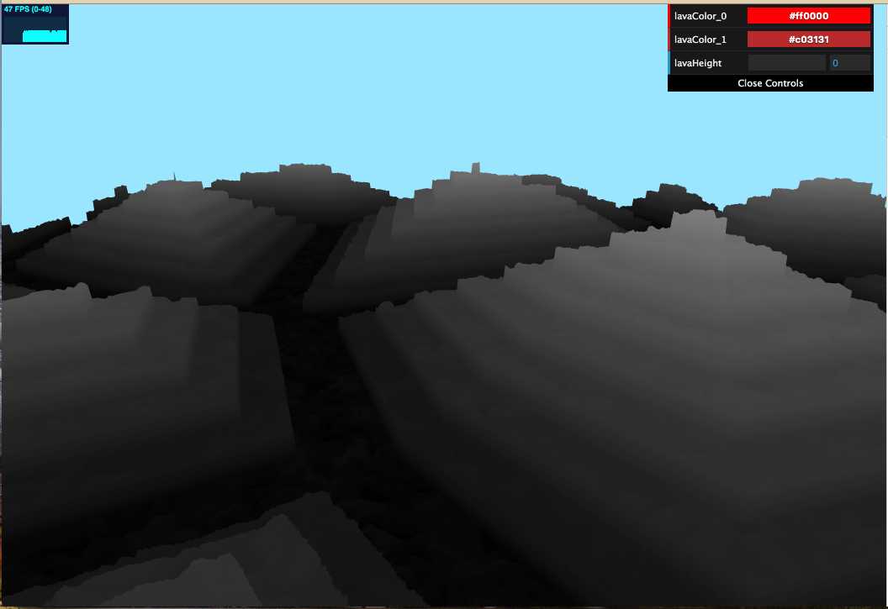

# WebGL L-system

An noise-based terrain generator and viewer implemented in WebGL.

**University of Pennsylvania, CIS 566 Procedrual Graphics, Noise Terrain**

* Zichuan Yu
  * [LinkedIn](https://www.linkedin.com/in/zichuan-yu/), [Behance](https://www.behance.net/zainyu717ebcc)
* Tested on: Macbook Pro macOS High Sierra Version 10.13.6 (17G66), i7-4870HQ @ 2.50GHz 16GB, AMD Radeon R9 M370X 2048 MB, Intel Iris Pro 1536 MB

## [Live Demo](https://zichuanyun.github.io/l-systems-WebGL/index.html)

## Features

### Shape

The shape is based on IQ's Voronoi border finding algorithm. Some noise is also added.

### AO

Fake AO is applied. When the lava is higher, the AO is less.

### Color Transist

To fake light from lava. The bottom of the terrain is lighter than the top because the bottom is closer to the lava.

### Lava

Value-noise-based FBM with adjustable height and color.

## Credits

- [Book of Shader, Cellular Noise](https://thebookofshaders.com/12/)
- [Book of Shader, FBM](https://thebookofshaders.com/13/)
- [IQ, Voronoi borders](https://thebookofshaders.com/12/)

